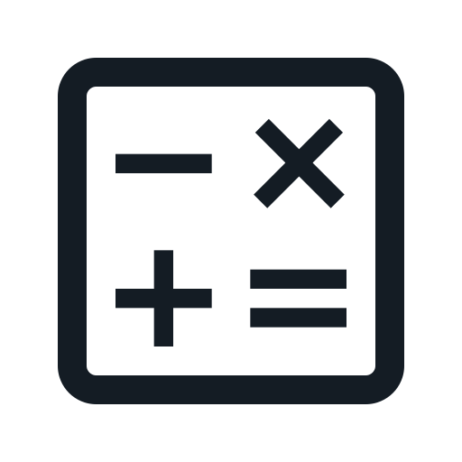

<p align="center">
  
</p>

# ShiftDrop


[](https://github.com/freegatik/ShiftDrop/actions/workflows/ci.yml)

iOS app built with **UIKit** (Swift **5**, iOS **17.5** minimum). Delivery cost calculation and order flow: tab-based shell, modal calculation stack, forms, and API integration. Layout uses **SnapKit** (Swift Package Manager). Dependencies and networking are wired through **`AppDependencies`** and **`AppCoordinator`** — see [ARCHITECTURE.md](ARCHITECTURE.md).

## CI

Automation on [GitHub Actions](https://github.com/freegatik/ShiftDrop/actions) (workflow [`.github/workflows/ci.yml`](.github/workflows/ci.yml), branch **`main`**):

| Job | What it runs |
|-----|----------------|
| **SwiftLint** | `swiftlint lint --strict` with the GitHub Actions logging reporter (SwiftLint installed via Homebrew on the runner) |
| **Build** | `xcodebuild build` for **generic** iOS Simulator (`ONLY_ACTIVE_ARCH=YES`, simulator `EXCLUDED_ARCHS=x86_64`) |
| **Unit tests** | `xcodebuild test` with `-only-testing:ShiftDropTests`, code coverage, `.xcresult` → artifact **`unit-test-results`** |
| **UI tests** | `xcodebuild test` with `-only-testing:ShiftDropUITests`, `.xcresult` → artifact **`ui-test-results`** |
| **Coverage report** | After unit tests, downloads the xcresult and runs [`.github/scripts/xccov-to-summary.sh`](.github/scripts/xccov-to-summary.sh); uploads **`coverage-report`** |
| **Repository metrics** | Swift file counts / approximate LOC into the job summary |

**Build**, **Unit tests**, and **UI tests** run [`prepare-ios-ci.sh`](.github/scripts/prepare-ios-ci.sh) on **`macos-15`**: `xcodebuild -runFirstLaunch`, simulator service kickstart, and (on Actions) `xcodebuild -downloadPlatform iOS` with retries when the iOS simulator platform is missing.

Test jobs create a simulator named **`ShiftDrop CI`** via [`ensure-ci-simulator.sh`](.github/scripts/ensure-ci-simulator.sh), then resolve an `xcodebuild` **`-destination`** with [`xcode-sim-destination.sh`](.github/scripts/xcode-sim-destination.sh) so the destination matches the booted device **UDID** (avoids `name=…` resolving to **`OS:latest`** when the runtime does not match).

Extras:

- **Dependabot** ([`.github/dependabot.yml`](.github/dependabot.yml)) opens weekly PRs for GitHub Actions pins.
- **Unit** and **UI** jobs upload **`.xcresult`** bundles on completion (`if: always()` where configured) so you can download them from the workflow run and open in Xcode (**Organizer → Reports** or drag the bundle onto Xcode).

## Requirements

- **Xcode 15+** (Swift **5**, packages resolve on first open)
- Simulator **iOS 17.5+** (matches `IPHONEOS_DEPLOYMENT_TARGET` and CI). **macOS 15+** matches the Actions image used in CI.

## Getting started

```bash
git clone https://github.com/freegatik/ShiftDrop.git
cd ShiftDrop
open ShiftDrop.xcodeproj
```

Xcode resolves **SnapKit** from SPM on first load. Use the **ShiftDrop** scheme: **⌘R** to run, **⌘U** for tests. For a device build, set your **Team** in Signing & Capabilities. Backend base URL: **`API_BASE_URL`** in [`ShiftDrop/Resources/Info.plist`](ShiftDrop/Resources/Info.plist).

## Project layout

| Area | Path / notes |
|------|----------------|
| App shell & coordinator | `ShiftDrop/App/` |
| Lifecycle | `ShiftDrop/Application/` (`AppDelegate`, `SceneDelegate`) |
| DI, networking, logging, localization | `ShiftDrop/Core/` |
| Models | `ShiftDrop/Models/` |
| Delivery UI flow | `ShiftDrop/DeliveryCalculation/` |
| Other tabs | `ShiftDrop/History/`, `ShiftDrop/Profile/` |
| Assets & plist | `ShiftDrop/Resources/` |

## Testing

- **`ShiftDropTests`** — API/session surfaces, coordinators, DTO Codable, UIKit helpers, table flows  
- **`ShiftDropUITests`** — smoke UI coverage ([`ShiftDropSmokeUITests`](ShiftDropUITests/ShiftDropSmokeUITests.swift))

On CI, unit and UI test bundles run in **separate jobs**; coverage artifacts come from **unit tests** only.

Coverage locally (replace `YOUR_UDID` from `xcrun simctl list devices available`):

```bash
xcodebuild test \
  -project ShiftDrop.xcodeproj \
  -scheme ShiftDrop \
  -destination 'platform=iOS Simulator,id=YOUR_UDID' \
  -only-testing:ShiftDropTests \
  -resultBundlePath /tmp/ShiftDrop.xcresult \
  -enableCodeCoverage YES
xcrun xccov view --report /tmp/ShiftDrop.xcresult | head -30
```

Lint: `swiftlint lint --strict` (see [`.swiftlint.yml`](.swiftlint.yml)).
